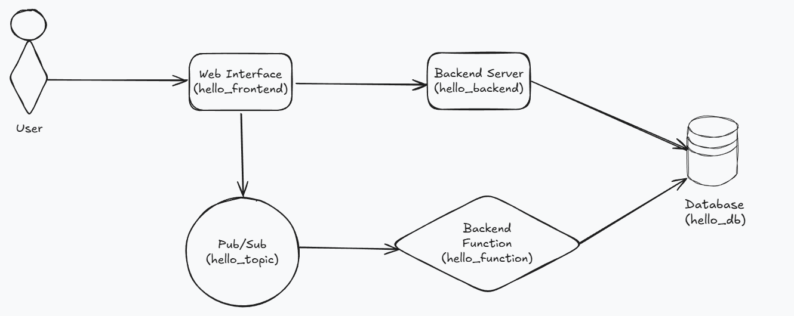

# TL;DR
- This repo contains step-by-step production ready setup tutorials for GCP
- These scenarios are designed for DevOps Engineers looking to up their GCP game (at least knowledge about the available services is recommended - this is not an entry level course, I expect you to know what we're doing, and I will show you how - but you know... you do you)
- It tries to explain complex GCP environment setup using a simple as a stick application that doesn't take attention away from the GCP infrastructure setup
- These scenarios are prepared to be fully executable from GCP Cloud Shell
- NOTE: I can't provide a lab environment for this, so unless you are using an account with free credit expect a small cost to incur whilst running these scenarios

# What You'll Learn
- Safely connect services running within GCP using best practices
- Setup a production ready GCP ecosystem
- How to deploy services without exposing half the internet to your database

# GCP DevOps Production Ready Tutorials

During my times of learning the GCP capabilities and principles I found myself being a little baffled with the perspective of the actual implementation in a production ready setup. While there are a lot of great hands-on lab exercises provided in the cloudskillboost platform that cover particular topics I realized there is quite a gap: it was either the scenarios were super simple to cover a principle, or when they got more complex they went overboard with complex app designs and skipped over the details giving ready-to-go scripts that provisioned the entire needed setup. After completing a lot of these what I ended up with was an (albeit quite good) understanding of specific topics, but it felt really overwhelming to tie this all together - kind of like being onboarded into a couple years old project - even though you know what you are doing you do feel lost. So I decided to create what I feel like was missing, a set of lab scenarios that will cover a production ready setups while using an application so simple that an ape would be able to work with it. Without further ado, welcome the...

## Hello Game App

This is a python based microservice application that does just two things, but its architecture allows us to explore quite a few GCP concepts, hopefully finding the perfect balance between complexity and learning potential. The application has following components:
- hello_frontend: provides a UI that let's the user:
    - submit their name in a form - the application will then respond with "Hello, {name}" and behind the scenes send the data (name) to a pub/sub queue
    - request a graph-like visual with a statistics of names submitted into the system
- hello_backend: a backend service that handles database migrations and feeds the frontend data for the statistics function
- hello_function: a cloud function performing that parses the data from pub/sub queue and submits the name into the app database
- hello_db: a relational database that is used to store the names submitted to the game

Here's the graph with the aforementioned architecture:  

# Scenarios

### Scenario 1 - Because One Service Was Too Boring
Deploy the Hello Game App in a serverless environment using Cloud Run, Cloud Run Functions, Pub/Sub and Cloud SQL. We will explore the implementation of principle of least privilege, and learn how to connect these managed services together while keeping all of the traffic (except for the app frontend) safely inside the GCP internal network. We will also use passwordless authentication for our services.

### Scenario 1a - Small improvements (what could've been done but didn't have to be done)
Work in progress...
We fix the DB setup to be done programmatically. We create an internal domain so our backend doesn't get a random, external URL every time we deploy it. 

### Scenario 2 - Automated Rollbacks So We Can Sleep at Night
Work in progress...
This scenario extends Scenario 1 to implement an SLO based auto-healing setup for the Hello Game App environment. And then we test it...

### Scenario 3 - 
Work in progress...
The team wants to test the possibility to deploy Hello Game App to a Kubernetes cluster because they plan to expand heavily adding new features and consider packing the deployment into a helm chart. You are tasked with creating a PoC deployment of existing Cloud Run services to a GKE cluster.

--- notes:
3. Add a repo structure section

Something like:

/scenario1
/scenario2
/app/hello_frontend
/app/hello_backend
/app/hello_function

This immediately grounds the reader.

4. Consider adding badges

DevOps folks appreciate quick visual cues:

“Cloud Shell ready”

“GCP only”

“Production patterns”

Not necessary, but nice polish.

5. Architecture diagram explanation

You include the diagram, but a couple of sentences explaining the data flow (1-2-3-4) would make it more digestible.